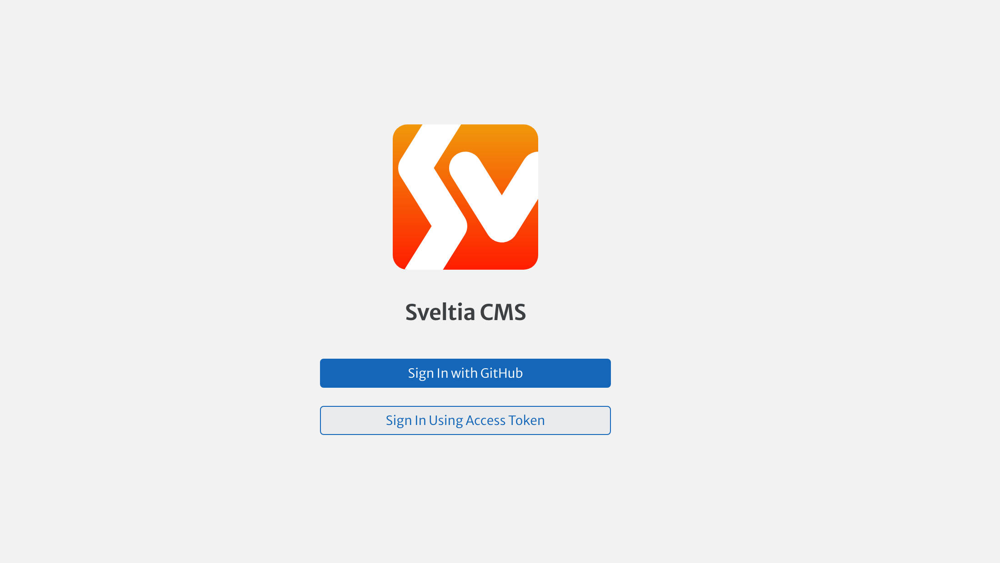
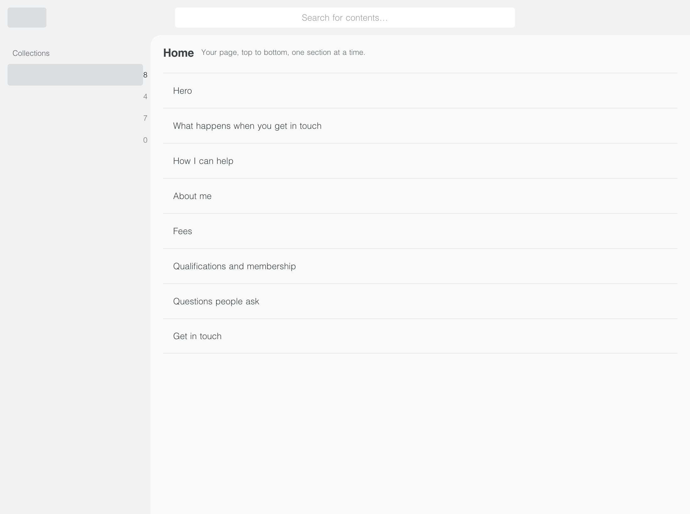
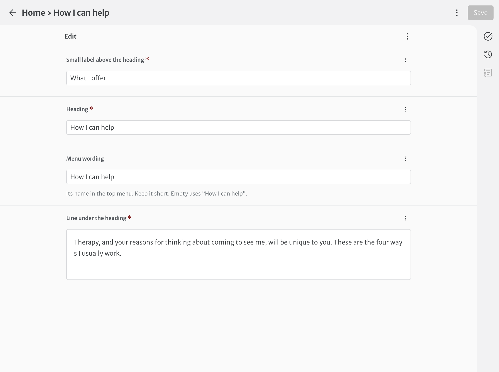
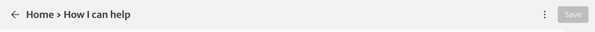
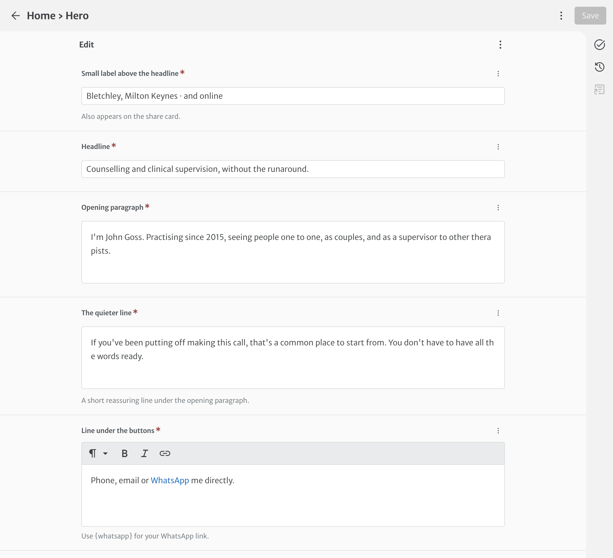

# Editing your website

**John Goss — Counselling & Supervision**
Preliminary edition, August 2026

---

## Before you start

Your website has an editor built into it. You sign in, you get a form with your own words already
in it, and when you save, the site rebuilds itself. The change is live a couple of minutes later.

There is no HTML, nothing to install, and nothing you can break by typing in the wrong box.

You need two things: a **GitHub account**, which is free and takes about two minutes, and the
**address of the editor**, which is your site's address with `/admin` on the end.

---

## 1. Setting up a GitHub account

GitHub is the service that stores your site's words and pictures. It is what you sign in to the
editor with, and it is the only account involved.

1. Go to **github.com** and choose **Sign up**.
2. Enter your email address. Use one you will still have in five years — the one you use for the
   practice is fine.
3. Choose a password. Write it down somewhere safe, or let your phone save it.
4. Choose a username. It is not shown on your website; it is only how GitHub knows you. Something
   plain is best.
5. GitHub emails you a code. Type it in.
6. When it asks what you want to do, you can skip every question. None of it affects you.
7. **Turn on two-factor authentication** when GitHub asks. It means a stolen password alone
   cannot get anyone in. The simplest option is a code sent to your phone. Another minute, and you
   will not think about it again.
8. **Send me your username.** This is the step everything else waits on, so do it before you close
   the page.

That last one matters more than it sounds. Your account exists, but it has nothing to do with your
website until I connect the two — and I connect them by username. Until I have it you can sign in
to the editor perfectly well and find nothing there to edit.

**Where to find it:** click your picture in the top right corner of github.com. Your username is at
the top of the menu, under "Signed in as". It is the short name you chose in step 4, not your email
address.

Send it to me however suits — text, WhatsApp, email. One word is enough.

---

## 2. Signing in to the editor

Go to your site's address with `/admin` on the end, and choose **Sign In with GitHub**.

The first time, GitHub asks whether you want to let the editor act on your behalf. Say yes. It
will not ask again on that device.

If you are ever signed out, it is the same three steps.

---

## 3. What you will see

The editor has four sections down the left.

**Home** — your front page, one section at a time, in the order someone scrolls through them:

> Hero · What happens when you get in touch · How I can help · About me · Fees ·
> Qualifications and membership · Questions people ask · Get in touch

Changing your fees means opening **Fees**, not scrolling past everything else you have written.
"Hero" is the trade's word for the dark band at the very top; the rest say what they are.

**Services** — one entry for each thing you offer. Each can have a longer page of its own, and
only gets one if you write it.

**General** — the things that appear in more than one place:

> Contact details · Testimonials · Social profiles · Membership and registration · Site ·
> Search engines and sharing · Wording on buttons and labels

Your number and email live in **Contact details**, and everything that links to you is built from
them.

**Blog** — your posts. It can be empty, and it is empty until you write one. Until then there is
no blog on the site at all — no link, no page.

Clicking one opens it. Every box is labelled, and most have a line underneath saying what the box
is for.

---

## 4. Making a change

1. Click the section you want.
2. Change the words.
3. Click **Save**, top right.

That is all of it. A minute or two later the live site has caught up.

You do not have to finish. Save whenever you like; a half-written sentence is only a half-written
sentence, and you can come back to it.

---

## 5. Pictures

Anywhere the editor asks for a picture, it is optional and it works the same way: click, choose a
file from your computer or phone, save.

Pictures are made smaller automatically. A photograph straight off your phone is fine — you do not
need to shrink it first.

**Your photograph** — the field is in **Home → Hero** — is the one exception worth understanding. The site cuts
you out of it and places you on the blue circle. A plain, evenly lit background works best — a
wall, a plain backdrop, anything without much going on behind you. If a photographer gives you a
picture that is already cut out, with no background at all, the site uses it as it is.

**Every picture asks for a description.** It is read aloud to anyone who cannot see the picture,
and it is a few words, not a sentence: "John in his consulting room". If the picture is only
decoration and says nothing the words do not, leave it empty.

---

## 6. Writing a post

**Blog → New Post.** The form asks, in this order:

- **Title**.
- **Status** — a draft is not built into the site at all. There is no page for it and nothing to
  find. Set it to Published when you are ready.
- **Publish on** — a date in the future means the post appears by itself at that moment. You do
  not have to be there.
- **Summary** — two or three lines. This is what shows in the list of posts.
- **Picture** and **Picture description** — both optional. See chapter 5.
- **Body** — write it. Use **Heading 2** to break a long post into parts, and **Heading 3**
  underneath those.
- **Search engine summary** — leave it alone. Empty, it uses the post's own title and summary,
  which is usually right.

---

## 7. Things worth knowing

**Nothing you do is destructive.** The site remembers every version. A wrong edit is undone, not
mourned.

**Your number and your email are written down once.** They live in **General → Contact details**,
and every Call button, every email link and the WhatsApp link are built from them. Change the
number there and it changes everywhere.

**Some boxes want `{phone}` or `{mailto}` rather than the thing itself.** Where you see that, leave
it. It is how the site fills in your number without you having to keep two copies of it in step.

**The second button at the top of the page always opens an email**, whatever you write on it. So
word it as an invitation to write to you.

**The menu at the top follows your headings.** Each section has a *Menu wording* box; leave it
empty and it uses the heading.

---

## 8. If something looks wrong

Give it five minutes — a save takes a couple of minutes to reach the live site, and browsers hold
on to old pages.

Then ring or write to me. Tell me what you changed and what it looks like. Nothing you can do in
the editor is unrecoverable, so there is no hurry and nothing to be careful about.

---

## Still to come

This is a preliminary edition, written before the site went live. Two things will be added once
they are settled:

- **The live address**, and whether saving publishes straight to it or whether there is a step in
  between.
- **Screen captures** of each part of the editor.
